Zoop - Mini Backend Setup Assignment

# Project Overview:

The document describes a step by step process in desigining the architecture of a mini backend system setup on AWS EKS. The project is divided into three parts; Backend Logic , Deployment and AWS Setup. The project demonstrates a event-driven backend application integrated with Redis and Kafka . User sends a request to increment the counter, the backend application updates the counter values in Redis and then Publishes an event to Kafka . Consumers are continously listening to Kafka and processes incoming event by printing them into logs.

# Architecture
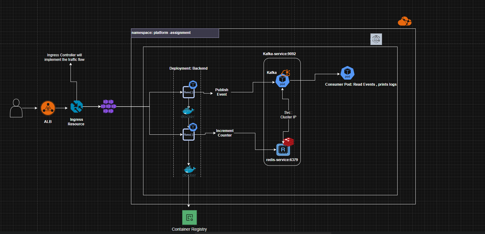

# Prerequistics

1. Kubectl and eksctl has to be installed on the system as it helps the user to interact with the cluster and create VPC , roles , subnets and required configuration while creating EKS Cluster.
2. Ensure Docker Desktop is running as background process , while solving instructions written in dockerfile.
3. Install AWS CLI and configure credentials.
4. Create a IAM User on AWS and gave permissions while creating EKS cluster.

# Steps
1. Verify AWS Connectivity: Verify whether the local machine is connected to AWS properly. 
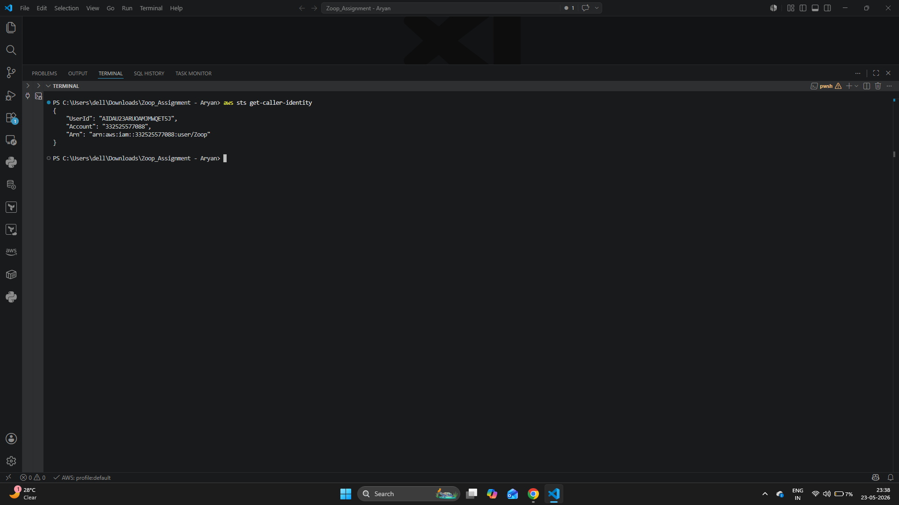

2. Create EKS Cluster: Using eksctl , gives instructions to AWS to automatically create required config for AWS EKS .
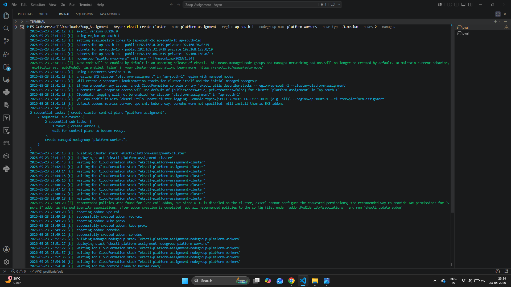
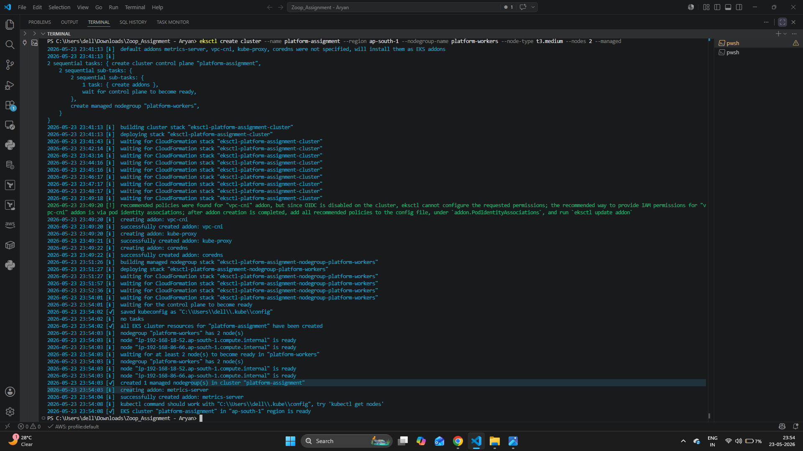

3. Update kubeconfig so kubectl can interact with the EKS cluster.
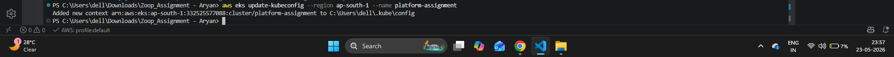

5. Verify whether the cluster is successfully created.
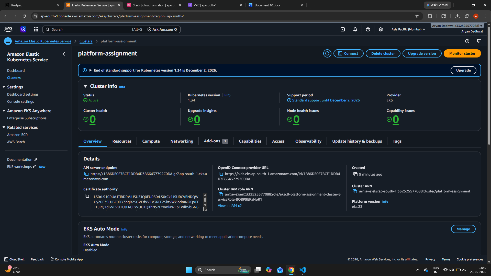

6. Move to application directory and build Docker image.
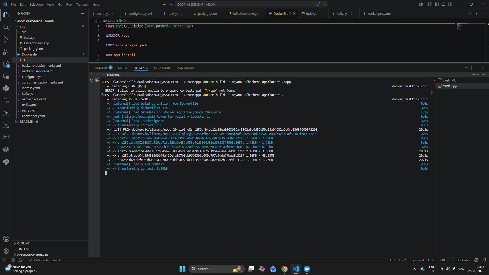

7. Tag and push Docker image to DockerHub.
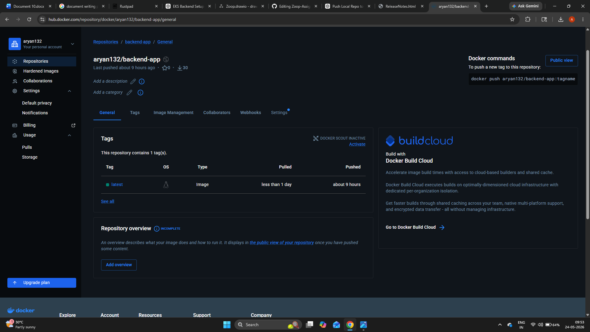  

8. Install NGINX Ingress Controller
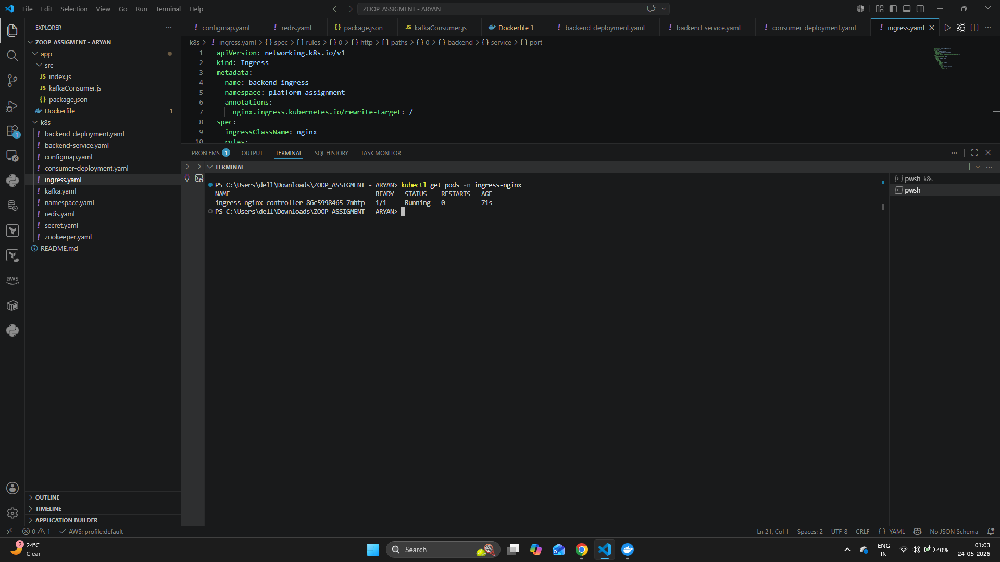

9. Deploy all Kubernetes resources.
    -- backend-deployment.yaml
    -- backend-service.yaml
    -- configmap.yaml
    -- consumer-deployment.yaml
    -- ingress.yaml
    -- kafkayaml
    -- redis.yaml
    -- secret.yaml
    -- zookeeper.yaml

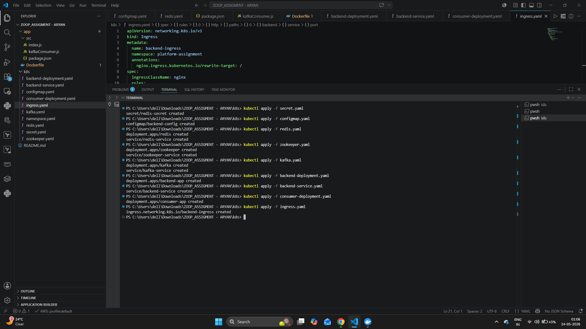

10. Verify Pods and Services in namespace platform-assignment.

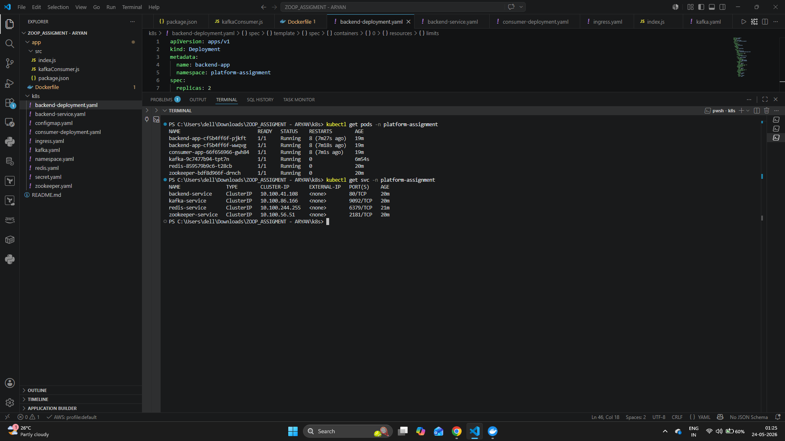

11. Verify the ingress resource.
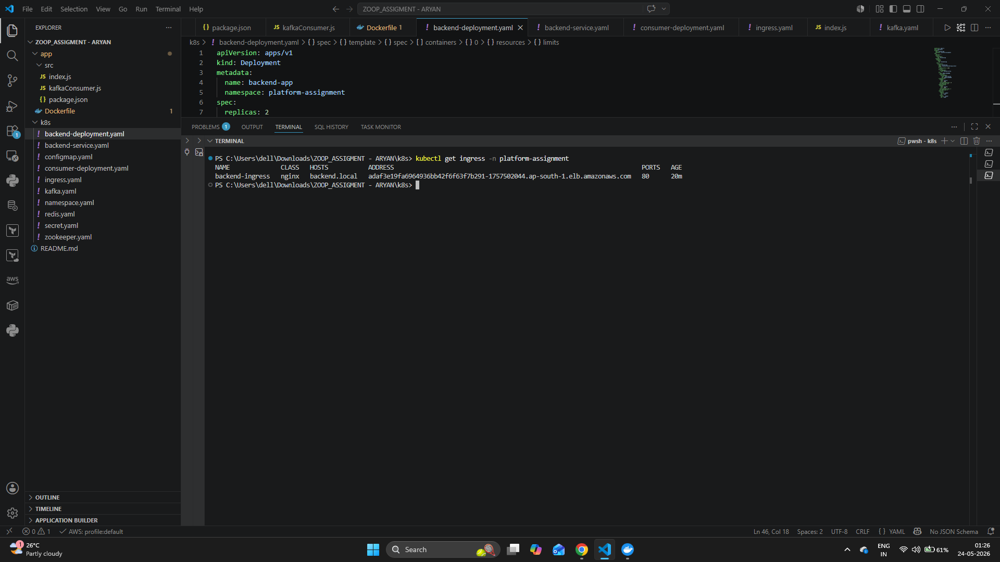

12. Validate the Health Check Endpoint
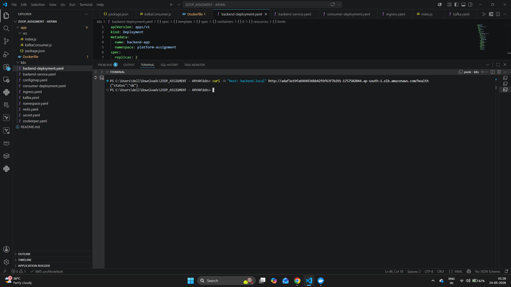

13. Validates the Connectivity of Redis Cache 
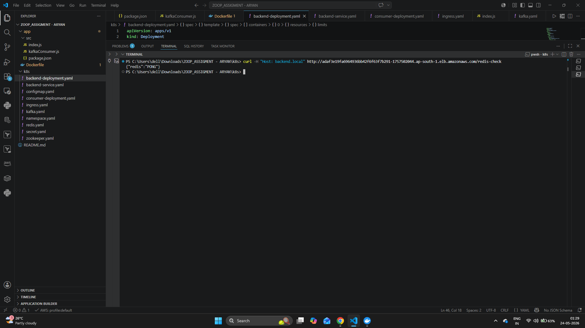

14. Validate Kafka Event Publishing.
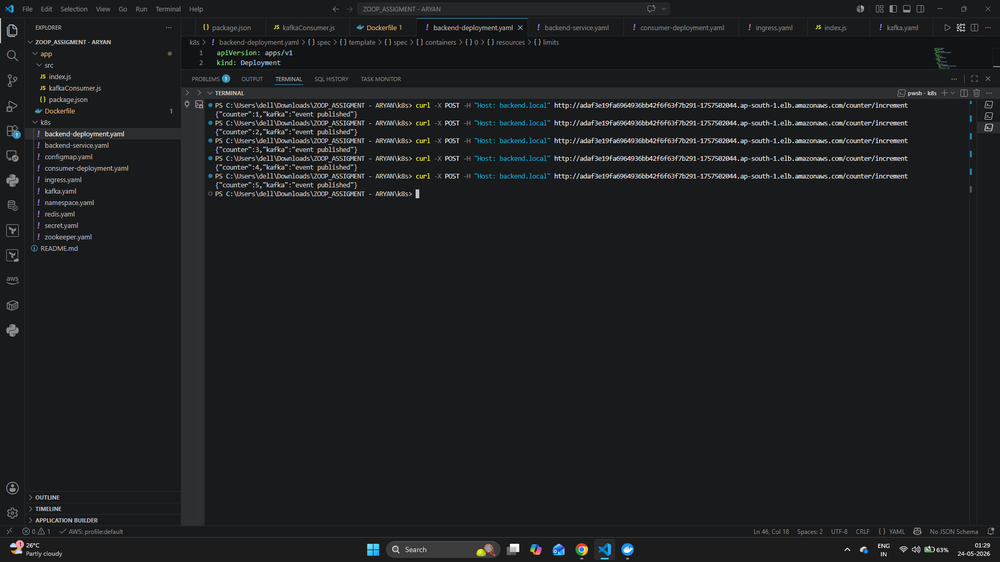

15. Validate Consumer Logs
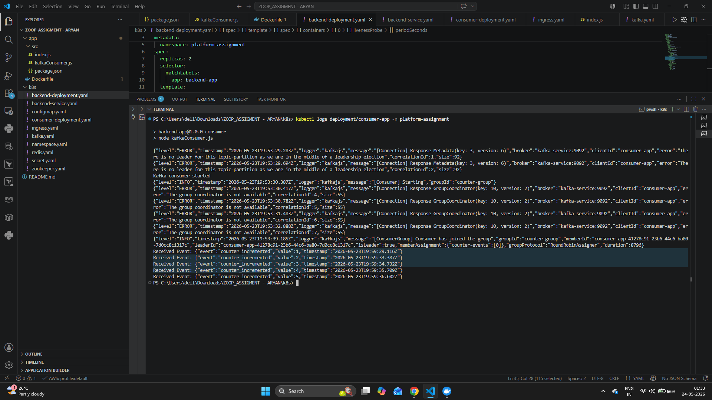
# Challenges 

1. CrashLoopBackOff : Kafka failed during startup because required environment variables were missing. Updated the image: confluentinc/cp-kafka:7.3.0 and add env variables KAFKA_LISTENERS and KAFKA_PROCESS_ROLES.
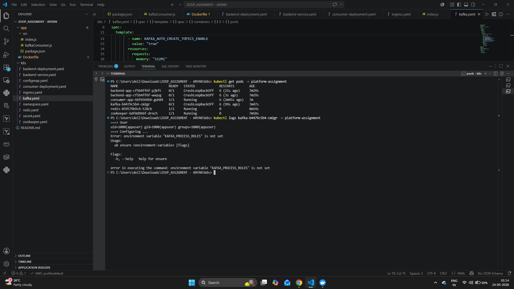

2. Ingress Returning 404 : It was expecting Host name we defined in Ingress Resource . While making a curl to specific endpoint we added Host and alb address.

# Production-Level Improvements

1. Ingress is currently configured using the default NGINX Ingress Controller without TLS enabled. In production environments, TLS certificates should be configured at the ingress layer so that HTTPS encryption and SSL termination happen at the ingress itself. Internal communication inside the cluster can continue over HTTP or later be secured further using mTLS/service mesh solutions such as Istio.

2. Currently, the containers are running with root privileges, which can introduce security risks in production environments. Running applications as root inside containers increases the impact surface if a container is compromised. In production, Kubernetes securityContext should be configured to run containers as non-root users with restricted privileges, read-only file systems, and limited Linux capabilities to improve workload isolation and overall cluster security.

3. Network policies: Its lets user to define instructions how the traffic flow within the cluster, service or pods. It helps us to secure the pod to pod, IP or Port communication.

4. Stateful Sets and Daemon Sets: Redis and Kafka services needs stable network connectivity and defined memory also Daemon sets can be attached to Backend application for logging and monitoring .

5. Istio: Istio comes with variety of functionalities, But 4 core are the most important i.e.: COSR means Connectivity , Observability , Security and Resilience. Mtls helps in securing the ingress and egress flow and it send telemetry to IstioD that can helps us with distributed tracing . 

    Scale in Istio: As the number of microservices increases, sidecar proxies continuously communicate with ISTIOD for telemetry exchange. In large-scale environments, a single ISTIOD instance can become a bottleneck. Therefore, ISTIOD components should be horizontally scaled to handle increasing traffic, telemetry data while maintaining control plane stability and performance.

    In production - Systems :

    1. Circuit Breaking : If Service A making a call to Svc B(unhealthy) make sures the system automatically break the channel.
    2. Outlier Detection: Remove the unhealthy pods from namespace and let the traffic reach to healthy ones.
    3. Retries: Istio can automatically retry failed requests before returning an error to the user. This improves application reliability during temporary network failures or short-lived service disruptions.
    4. Timeouts: Timeout policies help prevent requests from waiting indefinitely for unhealthy or slow services

6. Zero-Downtime deployments: Rolling updates are good but takes time to spin up the pods. In Zoop the connection of users with pods need to be consistent during streaming , I'll implement traffic shifting and connection draining policies to keep the old connections of users intact with pods and new connections will be shifted to newly created pods.

7. Authentication and Authorization: In production environments, ingress should be integrated with identity providers such as Okta, Keycloak, or OAuth-based authentication systems to validate incoming user requests and enforce proper authentication and authorization policies. This helps secure APIs, manage user identity, and control access to protected services.

8. Secrets: Currently in the project secrets are stored in .Yaml file encoded using Base64 . In production, I'll use Secret Manager or services like vault to store our secrets .

9. Distributed Tracing: For end to end request tracing , latency , response times , services communication and health I'll either implement Kiali or Using Dynatrace. I’ll also implement SLI, defines what makes our system healthy and set SLO(Targets ) for System to be uptime and deployments making sure bad deployments doesn’t affects our operations keeping system scalability and user experience in mind.

 Dynatrace: Dynatrace comes up with lot of features, Workflow (Alerting ) , Dashboard, Log Ingestion Pipelines and One Agent (monitor individual state of application). Distributed tracing, Davis AI (Using smart        topology and Root tree analysis) helps the Teams to understand what's the exact cause of failure is. It connects number of events internally and prepares a detailed report report tells you where the root cause is. Helps us in reduced the MTTR for recovery during critical times.

10. Horizontal Pod Autoscaling (HPA):   HPA allows Kubernetes to automatically scale application pods based on metrics such as CPU and memory usage. However, scaling is not always immediate, and during sudden traffic spikes new pods can take time to start, pull images, and become ready to serve requests.

In production environments,to improve reliability, additional baseline pods can be kept running during expected high-traffic hours, weekends, campaigns, or product launches. Advanced scaling strategies such as predictive scaling, scheduled autoscaling, and cluster autoscaler integration can also be implemented to ensure faster workload handling and better resource optimization.

11. Use Multi Docker Image in productions with ARG NODE_ENV for specific ENV and a dedicated user inside container if needed .

# Zoop Architecure Diagram

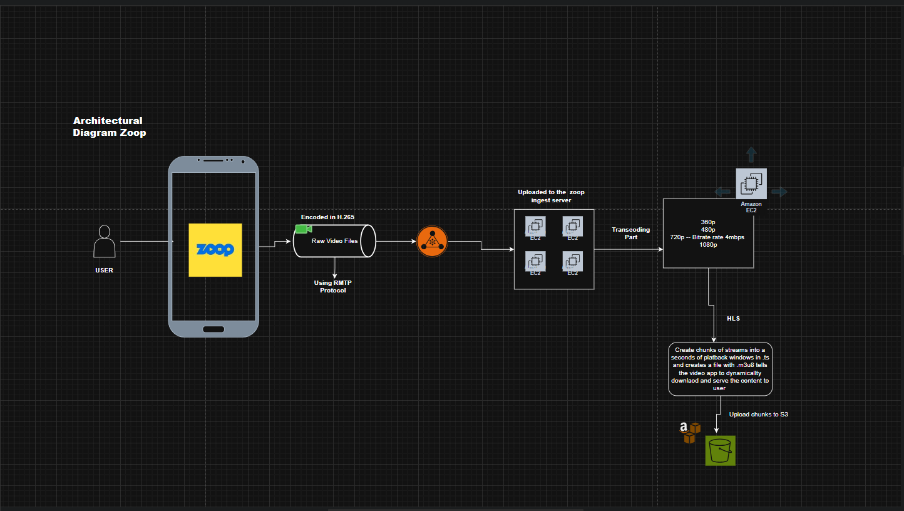
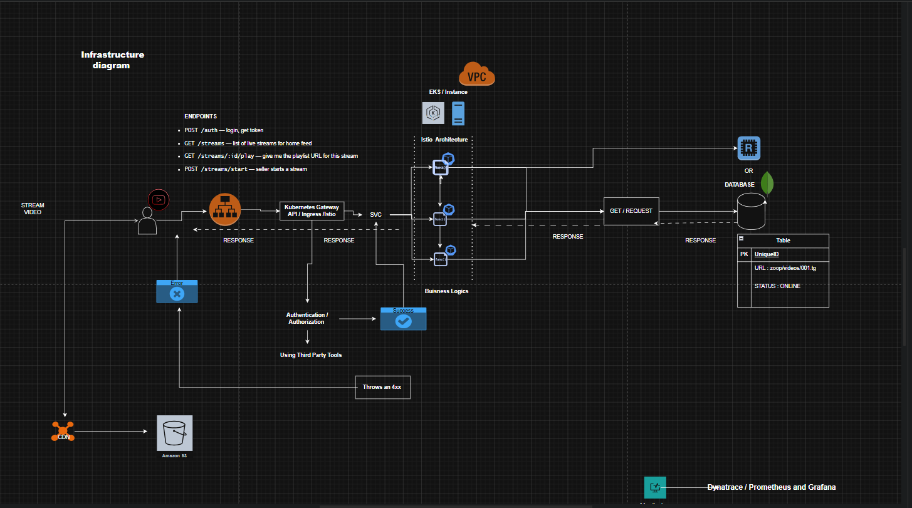
